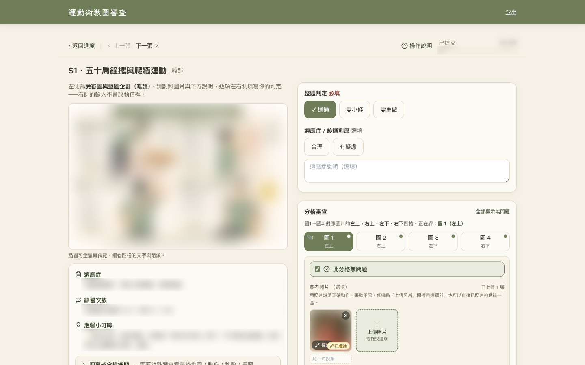
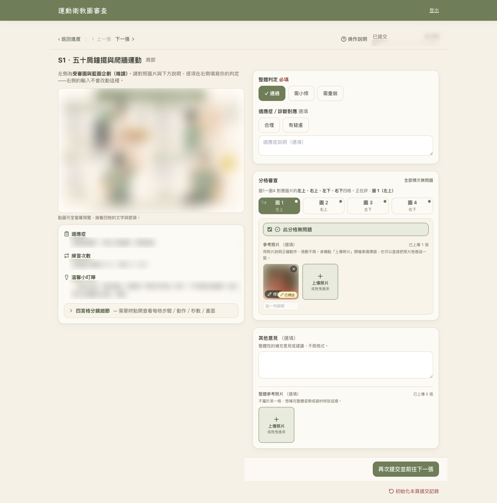
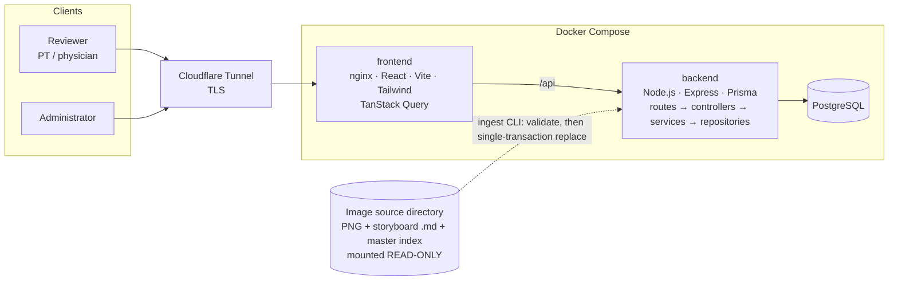
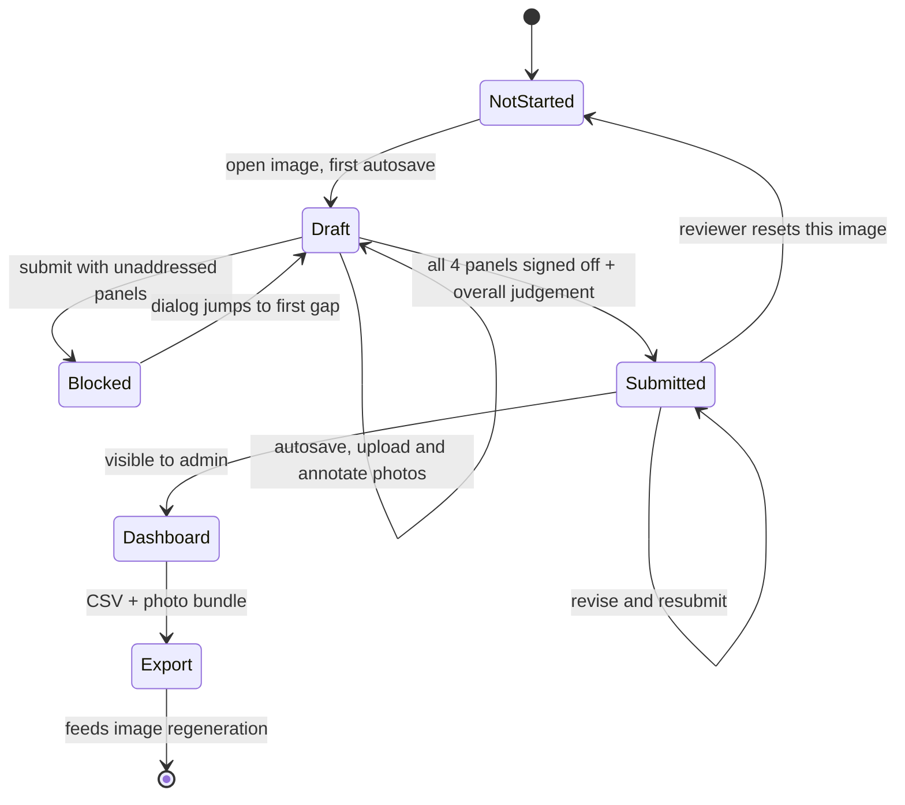

# physical-image-eval

**English** · [繁體中文](README.zh-TW.md)

**A clinical review tool that puts physical therapists and physicians in the loop before AI-generated patient-education images reach patients.**



<sub>Screenshot from the production deployment. The education image, its storyboard text, the reference photo and progress figures are deliberately blurred — the image assets belong to the clinical team and are not part of this repository.</sub>

<details>
<summary>Full-page view of the review workspace</summary>



</details>

---

## The problem

Our team builds an AI assistant for physical-therapy patient education. Part of its output is a library of **AI-generated four-panel exercise comics** — one per rehabilitation protocol, covering the shoulder, neck, elbow/wrist/hand, spine, hip, knee, ankle and whole-body prescriptions such as osteoporosis or fall prevention.

Generative models are good at producing images that *look* right. In rehabilitation, "looks right" is not enough:

- A plausible-looking movement may be the **wrong exercise** for the diagnosis.
- A post-surgical or fracture protocol with a **missing contraindication** can hurt someone.
- Image models routinely garble **text, rep counts, durations and arrows**.

None of this can be caught by another model with the confidence a patient deserves. It needs a licensed clinician looking at every image. Clinicians, however, are busy and non-technical, and a structured, per-panel, multi-reviewer sign-off does not fit in a shared document.

This project is the missing piece: **a purpose-built human-in-the-loop review workflow for AIGC medical content.**

## What it does

Each image is reviewed against the four questions the clinical team actually cares about:

| # | Gate | What the reviewer checks |
|---|------|--------------------------|
| 1 | **Is the movement right?** | Are the four panels the standard rehab exercise for this diagnosis? |
| 2 | **Is it safe?** | Are warnings and contraindications sufficient — especially post-op, acute-phase and osteoporotic cases? |
| 3 | **Is the indication right?** | Does the image fit every diagnosis mapped to it, including merged synonyms? |
| 4 | **Is the rendering right?** | Typos, wrong durations, arrows pointing the wrong way. |

### For reviewers (clinicians)

- **One screen per image.** The image and its original storyboard brief (indication, dosage, cautions) are read-only on the left; the structured judgement form is on the right.
- **Per-panel sign-off.** Every one of the four panels must be explicitly marked "no problem" or annotated with problem types, required warnings and notes. The gate is enforced on both client and server, so "I skimmed it" cannot be submitted.
- **Reference photos with annotation.** When words fail ("the elbow should be *here*"), the reviewer uploads a photo of the correct posture and draws arrows on it in the browser. These become source material for regenerating the image.
- **High-risk flagging.** Post-surgical and fracture protocols carry a visible, non-colour-only badge everywhere they appear.
- **Low friction.** Debounced autosave, draft restore, previous/next navigation, a keyboard-reachable fast path for clean images, and a first-visit guided tour. Reviewers only ever see their own work.

### For administrators

- **Closed account lifecycle.** There is no registration surface anywhere. Admins create accounts singly or in batch; accounts with submitted reviews cannot be deleted.
- **Progress dashboard.** Completion by reviewer and by image, with each image's independent reviews side-by-side for cross-reviewer comparison.
- **Export.** A CSV of all submitted reviews (Excel-safe, formula-injection-guarded) and a bundled download of reference photos as a retouching worklist.
- Admins **do not review images** — the two roles are strictly separated and enforced at the server boundary.

## Architecture



Two data domains are kept strictly apart:

- **Catalog domain (read-only reference):** regions, blueprints, panels, diagnosis→blueprint mapping, high-risk flags. Produced *only* by re-running ingestion against the source directory. The source directory is an external asset mounted read-only; no code path may write to it, and a failed ingestion leaves nothing half-applied.
- **Review domain (mutable):** accounts, sessions, audit log, reviews, per-panel reviews, reference photos. This is the only data users can create. Reviews reference blueprints by stable business code rather than foreign key, so re-ingesting the catalog never orphans or cascades clinical judgements.

### Review lifecycle



Only **submitted** reviews ever surface on the admin side; drafts stay private to the reviewer.

## How it was built: I write the spec, AI writes the code

This project is also a deliberate experiment in **directing an AI coding agent to production quality** rather than pair-typing with one. The division of labour:

| I own | Claude Code does, under those constraints |
|---|---|
| Requirements gathering with the clinical team | Implementation of each task |
| The project **constitution** — 11 non-negotiable principles | Tests first (red → green → refactor) |
| Every feature **spec** (WHAT / WHY, acceptance criteria) | Parallel review passes (security, database, TypeScript, constitution compliance) |
| Clarification decisions and architectural trade-offs | Fixing every finding before commit |
| Reviewing plans and code, accepting or rejecting | Hand-off documents for the next session |
| Production deployment and data-migration sign-off | |

The workflow is **Spec-Driven Development** with [GitHub Spec Kit](https://github.com/github/spec-kit):

```
constitution → specify → clarify → plan → checklist → tasks → analyze → implement
```

What makes this work in practice:

- **The spec is the single source of truth.** No code change without a spec change first; when reality and spec disagree, the spec is fixed first. Every commit traces to a constitutional principle or a numbered requirement (`FR-0xx`, `SC-0xx`).
- **Guardrails are written down, not remembered.** "No open registration", "image source is read-only", "roles enforced server-side", "status is never conveyed by colour alone" live in the [constitution](.specify/memory/constitution.md), so the agent is held to them in every session — including the ones where I forget to say so.
- **Safety-critical rules get triple coverage** — constitution, spec acceptance criteria, and UI rule — and the high-risk image set is a single named constant shared by ingestion and UI so it cannot drift.
- **AI blind spots are caught by gates, not trust.** The same model that writes code will happily approve it, so quality is enforced by things that cannot be talked around: a coverage threshold, server-side validation tests, E2E runs against the real Docker stack, and a before/after regression corpus for production data migrations.

The full paper trail is in the repo: [`specs/`](specs/) holds the spec, plan, data model, API contracts and task list for each of the four features, plus the [UI design system](specs/design/ui-ux-design-system.md).

| Feature | Scope |
|---|---|
| [`001-accounts-auth`](specs/001-accounts-auth/) | Admin-only account lifecycle, sessions, CSRF, rate limiting, audit log |
| [`002-blueprint-catalog-ingestion`](specs/002-blueprint-catalog-ingestion/) | Read-only ingestion of the image source into the catalog domain |
| [`003-reviewer-review-workflow`](specs/003-reviewer-review-workflow/) | Review workspace, per-panel sign-off, autosave, reference photos & annotation |
| [`004-admin-dashboard-export`](specs/004-admin-dashboard-export/) | Progress dashboard, cross-reviewer comparison, CSV & photo export |

## Engineering practices

- **Test-first, three layers.** Several hundred automated tests: Vitest unit tests, supertest integration tests against a real PostgreSQL, React Testing Library component tests, and Playwright end-to-end suites for authentication, reviewing, photos and the admin dashboard. An **80 % coverage gate** applies to both backend and frontend.
- **Security baseline on every commit.** argon2id password hashing, opaque session tokens hashed at rest, CSRF double-submit, rate-limited login with generic failure messages, allow-list validation at every boundary, no secrets in the repo, and the API is never published to the host — only the nginx frontend is reachable, behind the tunnel.
- **Data integrity under concurrency.** Review saves are a single-transaction upsert at `SERIALIZABLE` isolation with retry; ingestion is validate-then-replace in one transaction; account deletion protects submitted clinical data.
- **Accessibility as a requirement.** State is never colour-only, primary flows are keyboard-operable, and the visual design uses a warm, high-legibility palette chosen for clinicians reading dense CJK text on a laptop.
- **Small, layered code.** `routes → controllers → services → repositories` on the backend, feature-organised React on the frontend, immutable updates, files kept to a few hundred lines.

## Related work: repairing text inside the generated images

Image models render Chinese text poorly — wrong characters, malformed glyphs, garbled numerals. Regenerating an image to fix a typo usually breaks something else, so alongside this tool I built an offline **image text-repair pipeline** — [`tools/image-text-repair`](tools/image-text-repair/) (the images themselves are not included):

1. **Extract** every text line with on-device OCR, language correction disabled so the OCR reports what is actually drawn.
2. **Proofread** against the storyboard brief, with a recorded reason for every correction; a human approves each image before rendering.
3. **Erase** the original text with line-local inpainting, and **re-typeset** the corrected text in place with a consistent typeface, matching size, colour and alignment.
4. **QA** by OCR round-trip, and verify by checksum that the read-only source tree was never modified.

The interesting problems were in the image analysis: telling a faded character from a coloured icon by its *off-axis distance* from the ink↔background colour line rather than its distance from the ink colour; column-wise guarded region growing so erasure never eats a border or an icon's tip; and unifying font sizes across lines that play the same role. The corrected set mirrors the source layout exactly, so this tool can be pointed at it with a single environment variable.

## Status

Deployed and in use: physical therapists and physicians review real AI-generated education images through this tool, and their structured feedback and reference photos drive the next round of image corrections. The UI is Traditional Chinese only, by design — it is built for its actual users.

## Running it locally

Setup, ports, environment variables and test commands are in **[docs/DEVELOPMENT.md](docs/DEVELOPMENT.md)**. The short version:

```bash
cp .env.example .env            # set BOOTSTRAP_ADMIN_PASSWORD, COOKIE_SECURE=false for http
docker compose up -d --build    # postgres + backend + frontend → http://localhost:5180
```

The template points at **`demo/source/`**, a synthetic image set (placeholder comics plus storyboards and a master index that pass every ingestion check), so this runs as-is: log in as `admin` with the bootstrap password and create a reviewer account. The clinical image set is not distributed; point `IMAGE_SOURCE` at your own source to review real images.
