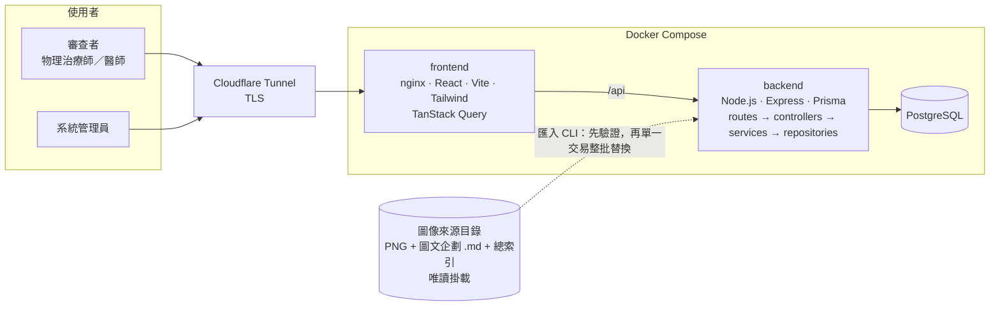
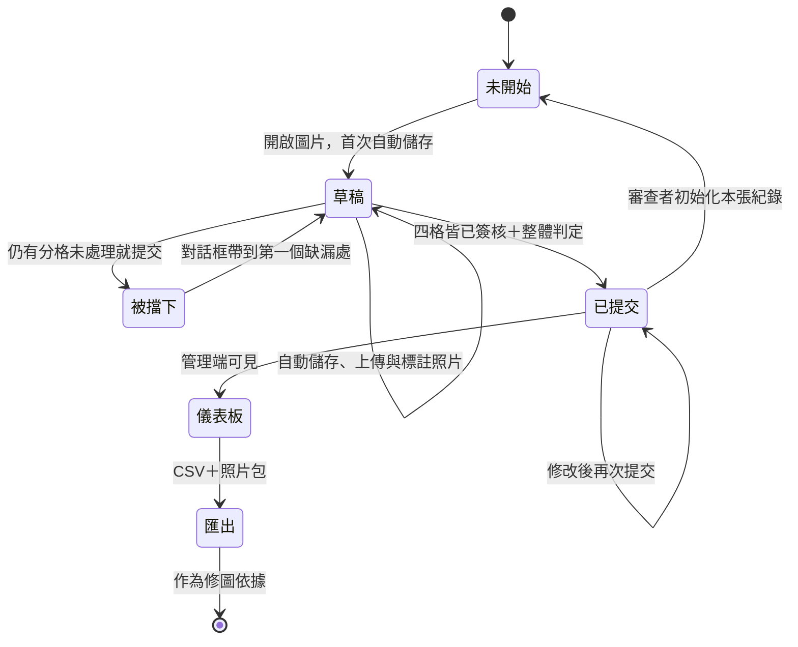

# physical-image-eval

[English](README.md) · **繁體中文**

**AI 生成的運動衛教圖在送到病人眼前之前，先讓物理治療師與醫師逐張把關的臨床審查工具。**


<sub>截圖取自正式環境。衛教圖、參考照片與數量資訊皆刻意模糊處理——圖像資產屬於臨床團隊，不包含在這個 repo 內。</sub>

<details>
<summary>審查工作區整頁截圖</summary>


</details>

---

## 要解決的問題

我們團隊在做一個「物理治療衛教 AI 助理」，其中一項產出是一整套 **AI 生成的四格漫畫運動衛教圖**——每個復健處方一張，涵蓋肩、頸、肘腕手、脊椎、髖、膝、足踝，以及骨鬆、防跌這類全身性運動處方。

生成式模型很擅長產出「看起來對」的圖。但在復健領域，看起來對遠遠不夠：

- 動作看似合理，卻可能**根本不是該診斷的標準運動**。
- 術後或骨折的處方只要**漏掉一條禁忌**，就可能讓病人受傷。
- 圖像模型經常把**文字、次數、秒數、箭頭**畫錯。

這些問題，沒辦法靠另一個模型檢查就讓人放心交到病人手上，必須由有執照的臨床人員逐張看過。但臨床人員很忙、不是工程背景，而「逐格、結構化、多位審查者各自獨立簽核」這種流程，用共享文件是撐不起來的。

這個專案補上的就是這一塊：**為 AIGC 醫療內容量身打造的 human-in-the-loop 審查流程。**

## 功能

每張圖都依臨床團隊真正在意的四個面向把關：

| # | 把關面向 | 審查者確認什麼 |
|---|----------|----------------|
| 1 | **動作對不對** | 四個分解動作是否為該診斷的標準復健運動 |
| 2 | **安全與禁忌** | 注意事項是否充分，特別是術後、急性期、骨鬆等高風險情境 |
| 3 | **適應症對不對** | 這張圖對應的所有診斷（含合併進來的同義診斷）是否合理 |
| 4 | **文字與畫面有沒有錯** | 錯字、秒數錯誤、箭頭方向錯誤 |

### 審查者（臨床人員）

- **一張圖一個畫面。** 左側是受審圖與原始圖文企劃（適應症、練習次數、叮嚀），唯讀；右側是結構化的判定表單。
- **逐格簽核。** 四格每一格都必須明確標示「無問題」，或填寫問題類型、應補警語與說明。這道關卡在前端與伺服器端同時強制，「大概看過」是送不出去的。
- **參考照片與標註。** 當文字講不清楚（「手肘應該在*這裡*」），審查者可以直接上傳正確姿勢的照片，並在瀏覽器裡畫箭頭標註，作為後續修圖的素材。
- **高風險標記。** 術後與骨折類處方在所有出現的地方都帶有明顯標記，且不只靠顏色傳達。
- **低摩擦。** 防抖自動儲存、草稿還原、上一張／下一張、乾淨圖可純鍵盤完成的快速路徑、首次進入的導覽教學。審查者永遠只看得到自己的紀錄。

### 系統管理員

- **封閉式帳號管理。** 任何地方都沒有註冊入口。帳號只能由管理員單筆或批次建立；已有提交紀錄的帳號不可刪除。
- **進度儀表板。** 依審查者、依圖檢視完成度；同一張圖上多位審查者的獨立結果並列，可跨人比對。
- **匯出。** 所有已提交審查的 CSV（Excel 可直接開、已防公式注入），以及參考照片整包下載，作為修圖工作清單。
- 管理員**本身不審圖**——兩種角色嚴格分離，並在伺服器邊界強制。

## 架構



兩個資料域嚴格分離：

- **目錄域（唯讀參考資料）：** 解剖區域、藍圖、分格、診斷→藍圖對照、高風險旗標。**只能**透過對來源目錄重跑匯入產生。來源目錄是唯讀掛載的外部資產，任何程式路徑都不得寫入；匯入失敗時不會留下半套資料。
- **審查域（可變資料）：** 帳號、session、稽核紀錄、審查、分格審查、參考照片。這是使用者唯一能建立的資料。審查以穩定的業務代碼（而非外鍵）指向藍圖，因此重新匯入目錄永遠不會讓臨床判定變成孤兒或被連帶刪除。

### 審查生命週期



只有**已提交**的審查會出現在管理端；草稿始終只屬於審查者本人。

## 怎麼做出來的：我寫規格，AI 寫程式

這個專案同時也是一次刻意的實驗：不是跟 AI 一起「結對打字」，而是**帶領一個 AI coding agent 做到可上線的品質**。分工如下：

| 我負責 | Claude Code 在這些約束下負責 |
|---|---|
| 與臨床團隊釐清需求 | 逐項任務的實作 |
| 專案**憲章**——11 條不可違反的原則 | 測試先行（red → green → refactor） |
| 每個 feature 的 **spec**（WHAT／WHY、驗收標準） | 平行審查（安全、資料庫、TypeScript、憲章符合性） |
| 釐清問題時的決策與架構取捨 | commit 前修完所有審查發現 |
| 審閱計畫與程式碼，決定接受或退回 | 撰寫給下一個 session 的交接文件 |
| 正式環境部署與資料遷移的最終把關 | |

採用的方法是 **Spec-Driven Development**，工具為 [GitHub Spec Kit](https://github.com/github/spec-kit)：

```
constitution → specify → clarify → plan → checklist → tasks → analyze → implement
```

實務上讓它行得通的關鍵：

- **spec 是唯一真實來源。** 沒有 spec 變更就不改 code；現況與 spec 不一致時，先修 spec。每個 commit 都能追溯到某條憲章原則或某個編號需求（`FR-0xx`、`SC-0xx`）。
- **護欄是寫下來的，不是靠記得。**「無開放註冊」「圖像來源唯讀」「角色在伺服器端強制」「狀態不得只靠顏色傳達」都寫在[憲章](.specify/memory/constitution.md)裡，agent 在每個 session 都受其約束——包括我忘記提醒的那幾次。
- **攸關安全的規則三重覆蓋**——憲章、spec 驗收標準、UI 規則；高風險圖的集合是單一具名常數，匯入與 UI 共用，不可能各說各話。
- **AI 的盲點靠閘道抓，不靠信任。** 寫程式的模型也會很樂意替自己的程式按讚，所以品質交給無法被說服的東西來守：覆蓋率門檻、伺服器端驗證測試、對真實 Docker 環境跑的 E2E，以及正式資料遷移前後的回歸比對。

完整的紙本軌跡都在 repo 裡：[`specs/`](specs/) 收錄四個 feature 各自的 spec、plan、資料模型、API 契約與任務清單，另有 [UI 設計系統](specs/design/ui-ux-design-system.md)。

| Feature | 範圍 |
|---|---|
| [`001-accounts-auth`](specs/001-accounts-auth/) | 僅管理員可操作的帳號生命週期、session、CSRF、限流、稽核紀錄 |
| [`002-blueprint-catalog-ingestion`](specs/002-blueprint-catalog-ingestion/) | 將圖像來源以唯讀方式匯入目錄域 |
| [`003-reviewer-review-workflow`](specs/003-reviewer-review-workflow/) | 審查工作區、逐格簽核、自動儲存、參考照片與標註 |
| [`004-admin-dashboard-export`](specs/004-admin-dashboard-export/) | 進度儀表板、跨審查者比對、CSV 與照片匯出 |

## 工程實務

- **測試先行，三層測試。** 數百個自動化測試：Vitest 單元測試、對真實 PostgreSQL 跑的 supertest 整合測試、React Testing Library 元件測試，以及涵蓋登入、審查、照片、管理儀表板的 Playwright 端對端測試。前後端皆設 **80% 覆蓋率閘道**。
- **每次 commit 的安全基線。** argon2id 密碼雜湊、不透明 session token 且雜湊後儲存、CSRF double-submit、登入限流與泛用失敗訊息、所有邊界以允許值清單驗證、repo 內零祕密；API 不對 host 開放，對外只有 tunnel 後面的 nginx 前端。
- **並發下的資料完整性。** 審查儲存是 `SERIALIZABLE` 隔離等級下的單一交易 upsert 並帶重試；匯入是「先驗證、再於單一交易內整批替換」；刪除帳號時保護已提交的臨床資料。
- **無障礙是需求，不是加分項。** 狀態不只靠顏色、主要流程可純鍵盤操作；視覺設計採溫暖、高可讀性的配色，為在筆電上閱讀密集中文的臨床人員而選。
- **小而分層的程式碼。** 後端 `routes → controllers → services → repositories`，前端依功能組織，不可變更新，單檔維持在數百行以內。

## 相關工作：修復生成圖裡的文字

圖像模型畫中文的能力很差——錯字、殘缺字形、亂掉的數字。為了改一個錯字而重新產圖，通常會弄壞別的地方，所以我另外做了一條離線的**圖像文字修復 pipeline**（與圖像資產一樣，不放在這個公開 repo）：

1. **擷取**：用裝置端 OCR 取出每一行文字，並關閉語言校正，讓 OCR 回報「實際畫了什麼」而不是它猜的。
2. **校對**：對照圖文企劃逐筆校對，每一筆修正都留下理由；每張圖須經人工核准才會進入渲染。
3. **抹除與重排**：以逐行局部 inpainting 抹除原文字，再用統一字體在原位重新排版，比照原本的字級、顏色與對齊。
4. **品管**：以 OCR 來回比對驗證，並用 checksum 證明唯讀的來源目錄從未被改動。

有意思的難題都在影像分析：區分「褪淡的文字」與「彩色圖示」時，用的是像素到「筆色↔背景色連線」的*離軸距離*，而不是與筆色的距離；區域擴張採逐欄防衛掃描，抹除時才不會吃掉框線或圖示的尖角；同一角色的文字行統一字級。修復後的圖集與來源目錄結構完全一致，這個工具只要改一個環境變數就能直接指過去。

## 現況

已部署上線並實際使用中：物理治療師與醫師透過這個工具審查真實的 AI 生成衛教圖，他們的結構化意見與參考照片，直接成為下一輪修圖的依據。介面刻意只提供繁體中文——它是為真正的使用者做的。

## 在本機執行

環境設定、port、環境變數與測試指令請見 **[docs/DEVELOPMENT.md](docs/DEVELOPMENT.md)**。精簡版：

```bash
cp .env.example .env            # 設定 BOOTSTRAP_ADMIN_PASSWORD；本機 http 請設 COOKIE_SECURE=false
docker compose up -d --build    # postgres + backend + frontend → http://localhost:5180
```

你需要自備圖像來源目錄（目錄結構見開發文件）；臨床圖像不隨此 repo 散佈。
